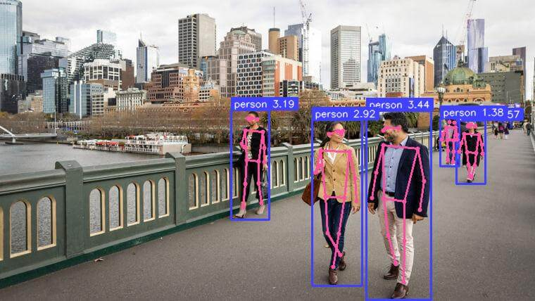
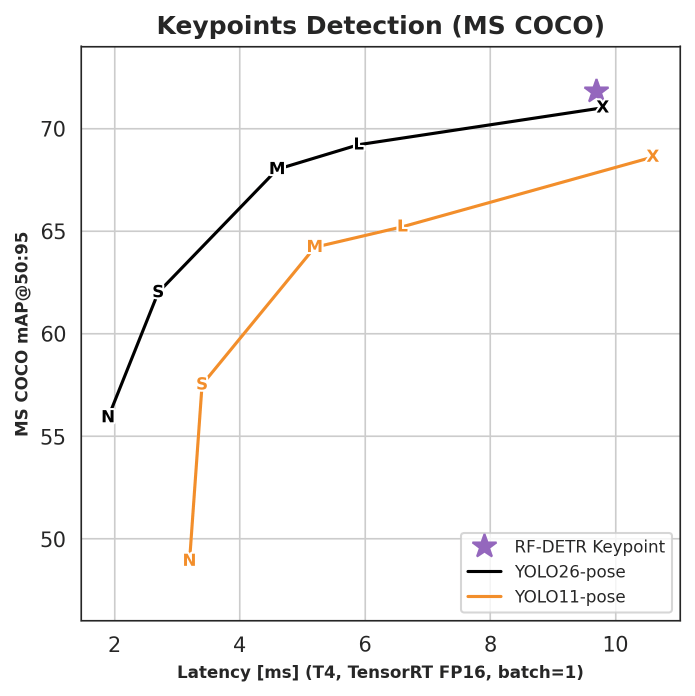
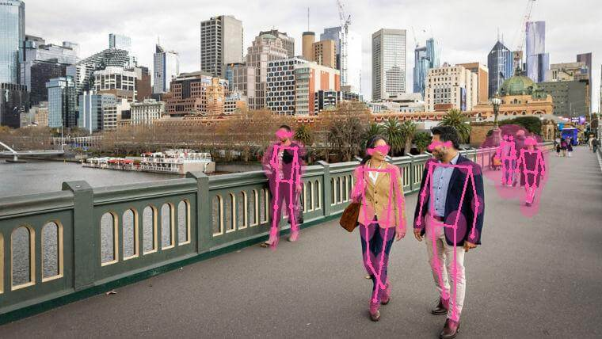

# Run an RF-DETR Keypoint Model

RF-DETR Keypoint is a real-time transformer architecture for keypoint detection, built on a DINOv2 vision transformer backbone. The preview model is pretrained on the Microsoft COCO dataset and predicts 17 body keypoints per detected person.



!!! note "Preview model"

    `RFDETRKeypointPreview` is an early-access release. Fine-tuning on custom keypoint datasets is the primary intended use case. See [Keypoint Preview Parameters](../train/training-parameters.md#keypoint-preview-parameters) for training configuration. API surface and checkpoint weights may change before the stable release.

## Pre-trained Checkpoints

RF-DETR Keypoint outperforms YOLO26-pose X and YOLO11-pose X at comparable latency on MS COCO. Latency measured on NVIDIA T4, TensorRT FP16, batch size 1.

{ width=560 }

|       Model        |  RF-DETR package class  | COCO AP<sub>50:95</sub> | Latency (ms) | Params (M) | Resolution |  License   |
| :----------------: | :---------------------: | :---------------------: | :----------: | :--------: | :--------: | :--------: |
| Keypoint (Preview) | `RFDETRKeypointPreview` |          71.8           |     9.7      |   126.4    |  576x576   | Apache 2.0 |

> The keypoint model is available in the `rfdetr` package only. It is not yet available via the `inference` package.

> Benchmark evaluated on COCO val2017 person keypoints (AP<sub>50:95</sub>) with the standard COCO 17-keypoint OKS sigmas; latency on NVIDIA T4, TensorRT FP16, batch size 1.

## Run on an Image

Perform inference on an image using the `rfdetr` package. `model.predict()` returns an [`sv.KeyPoints`](https://supervision.roboflow.com/latest/keypoint/core/) object containing skeleton coordinates and per-keypoint confidence scores for each detected person.

=== "rfdetr"

    ```python
    import cv2
    import supervision as sv
    from rfdetr import RFDETRKeypointPreview

    model = RFDETRKeypointPreview()

    image_bgr = cv2.imread("/path/to/image.jpg")
    image_rgb = cv2.cvtColor(image_bgr, cv2.COLOR_BGR2RGB)
    key_points = model.predict(image_rgb, threshold=0.5)

    annotated_image = sv.VertexAnnotator().annotate(image_rgb, key_points)
    ```



## Understanding the Output

`model.predict()` returns an `sv.KeyPoints` object. The fields most commonly used downstream:

| Field                             | Shape          | Description                                                                                                                                                                                                                                                                                                                                                                                                      |
| --------------------------------- | -------------- | ---------------------------------------------------------------------------------------------------------------------------------------------------------------------------------------------------------------------------------------------------------------------------------------------------------------------------------------------------------------------------------------------------------------- |
| `key_points.xy`                   | `(N, K, 2)`    | Pixel coordinates of each keypoint per detected instance                                                                                                                                                                                                                                                                                                                                                         |
| `key_points.keypoint_confidence`  | `(N, K)`       | Per-keypoint findability score; use to filter low-confidence points                                                                                                                                                                                                                                                                                                                                              |
| `key_points.detection_confidence` | `(N,)`         | Per-instance detection score; this is what `threshold` filters on                                                                                                                                                                                                                                                                                                                                                |
| `key_points.class_id`             | `(N,)`         | Model label ID for each detection. COCO-pretrained checkpoints use sparse COCO category IDs (1–90). Fine-tuned active-first keypoint checkpoints use normal 0-based class IDs; legacy background-first keypoint checkpoints use slot 0 as `"__background__"` and start foreground classes at slot 1. Use `key_points.data["class_name"]` for name resolution rather than indexing your class list by `class_id`. |
| `key_points.data["class_name"]`   | `(N,)`         | Class names resolved from `class_id`; prefer this over indexing a class-name list directly.                                                                                                                                                                                                                                                                                                                      |
| `key_points.data["xyxy"]`         | `(N, 4)`       | Bounding box for each detected instance in `[x1, y1, x2, y2]` format                                                                                                                                                                                                                                                                                                                                             |
| `key_points.data["source_image"]` | list of arrays | Source frame stored once per detection; all N entries are the same array — use `[0]` to access it                                                                                                                                                                                                                                                                                                                |

`K=17` for the pretrained COCO person-keypoint preview checkpoint. Fine-tuned checkpoints use the keypoint count from their dataset schema, so custom keypoint datasets can return any `K` supported by their COCO keypoint annotations.

Keypoints with `visible=False` are skipped by supervision annotators. To hide low-confidence joints manually, threshold `key_points.keypoint_confidence` and set matching entries to `False` in `key_points.visible`.

For fine-tuning on a custom keypoint dataset, see [Keypoint preview custom datasets](../train/index.md#keypoint-preview-custom-datasets).

## Run on video, webcam, or RTSP stream

These examples use OpenCV for decoding and display. Replace `<SOURCE_VIDEO_PATH>`, `<WEBCAM_INDEX>`, and `<RTSP_STREAM_URL>` with your inputs. `<WEBCAM_INDEX>` is usually `0` for the default camera.

=== "video"

    ```python
    import cv2
    import supervision as sv
    from rfdetr import RFDETRKeypointPreview

    model = RFDETRKeypointPreview()

    video_capture = cv2.VideoCapture("<SOURCE_VIDEO_PATH>")
    if not video_capture.isOpened():
        raise RuntimeError("Failed to open video source: <SOURCE_VIDEO_PATH>")

    while True:
        success, frame_bgr = video_capture.read()
        if not success:
            break

        frame_rgb = cv2.cvtColor(frame_bgr, cv2.COLOR_BGR2RGB)
        key_points = model.predict(frame_rgb, threshold=0.5)

        annotated_frame = sv.VertexAnnotator().annotate(frame_bgr, key_points)

        cv2.imshow("RF-DETR Keypoint Video", annotated_frame)
        if cv2.waitKey(1) & 0xFF == ord("q"):
            break

    video_capture.release()
    cv2.destroyAllWindows()
    ```

=== "webcam"

    ```python
    import cv2
    import supervision as sv
    from rfdetr import RFDETRKeypointPreview

    model = RFDETRKeypointPreview()

    WEBCAM_INDEX = 0  # Change this to the desired webcam index (e.g., 1, 2, ...)
    video_capture = cv2.VideoCapture(WEBCAM_INDEX)
    if not video_capture.isOpened():
        raise RuntimeError(f"Failed to open webcam: {WEBCAM_INDEX}")

    while True:
        success, frame_bgr = video_capture.read()
        if not success:
            break

        frame_rgb = cv2.cvtColor(frame_bgr, cv2.COLOR_BGR2RGB)
        key_points = model.predict(frame_rgb, threshold=0.5)

        annotated_frame = sv.VertexAnnotator().annotate(frame_bgr, key_points)

        cv2.imshow("RF-DETR Keypoint Webcam", annotated_frame)
        if cv2.waitKey(1) & 0xFF == ord("q"):
            break

    video_capture.release()
    cv2.destroyAllWindows()
    ```

=== "stream"

    ```python
    import cv2
    import supervision as sv
    from rfdetr import RFDETRKeypointPreview

    model = RFDETRKeypointPreview()

    video_capture = cv2.VideoCapture("<RTSP_STREAM_URL>")
    if not video_capture.isOpened():
        raise RuntimeError("Failed to open RTSP stream: <RTSP_STREAM_URL>")

    while True:
        success, frame_bgr = video_capture.read()
        if not success:
            break

        frame_rgb = cv2.cvtColor(frame_bgr, cv2.COLOR_BGR2RGB)
        key_points = model.predict(frame_rgb, threshold=0.5)

        annotated_frame = sv.VertexAnnotator().annotate(frame_bgr, key_points)

        cv2.imshow("RF-DETR Keypoint RTSP", annotated_frame)
        if cv2.waitKey(1) & 0xFF == ord("q"):
            break

    video_capture.release()
    cv2.destroyAllWindows()
    ```

## Visualization

`supervision` provides several keypoint annotators. Choose based on what you want to draw.

=== "EdgeAnnotator"

    Draws skeleton edges (lines between connected joints). Edges where either endpoint has `visible=False` are skipped automatically.

    ```python
    annotated = sv.EdgeAnnotator().annotate(image, key_points)
    ```

=== "VertexAnnotator"

    Draws a dot at each keypoint. Keypoints with `visible=False` are skipped automatically.

    ```python
    annotated = sv.VertexAnnotator().annotate(image, key_points)
    ```

=== "VertexEllipseAnnotator"

    Draws covariance ellipses from `key_points.data["covariance"]`, giving a visual footprint of per-keypoint uncertainty.

    ```python
    annotated = sv.VertexEllipseAnnotator().annotate(image, key_points)
    ```

=== "VertexEllipseHaloAnnotator"

    Draws the same covariance uncertainty with a soft halo for improved contrast on busy backgrounds.

    ```python
    annotated = sv.VertexEllipseHaloAnnotator().annotate(image, key_points)
    ```
